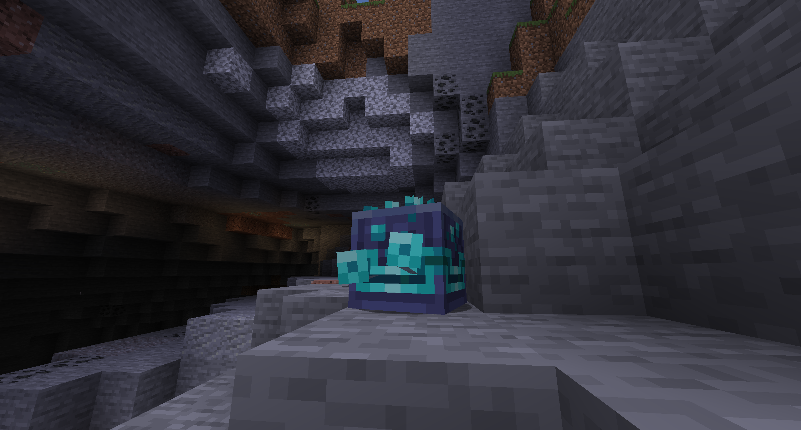

It's time to look at our editor-picked projects of the month! These are a small
selection of our personal favourite projects that came out recently - this is by
no means an exhaustive list, go look for yourself as well!

Do you know of any cool projects that you would like to be featured in next months issue? Let us know on the Discord at [https://mod-magazine.github.io/discord](https://mod-magazine.github.io/discord).

## [Cobblemon](https://modrinth.com/mod/cobblemon)

OK...so it didn't come out this month...or last month...or the month before
that. Cobblemon came out in October last year, but we wanted to give it a
mention since it has been gaining popularity recently.

<!-- COBBLEMON IMAGES AND TEXT -->

## [e4mc](https://modrinth.com/mod/e4mc)

e4mc actually came out this month, so we're off to a good start. This project is
interesting both technically and for regular players: it allows you to open your
LAN game to the wide world. That doesn't sound very cool, until you learn that
only the host needs e4mc installed. Your friends can connect with a vanilla
client. Gone are the days of those terrible free server hosts. I wish.

When you open a game to LAN, the mod will automatically send you a link in chat;
use it as the server IP in the connect menu, and you're good! On the backend,
e4mc uses a websocket server implemented in Rust, which automatically makes it
blazingly fast and better than every other piece of software ever created (I use
Rust btw).

## [Species](https://modrinth.com/mod/species)

Species is a mod that adds more mobs, a mob mod if you will - say that as fast as you can 10 times. It is being developed by a large team who plan to release updates, each with a specific theme. I wish more mods did this, as it creates a really nice community and feel.

Documentation is still a work in progress, but my personal favourites are the Birt and Limpet. The Birt is so cute and reminds me of Flappy Bird, while the Limpet is just goofy. Look at those silly eyes.

I'm excited to see what comes next for Species, hopefully it will involve more silly-eyed creatures.

## [Physics Toys](https://modrinth.com/mod/physics-toys)

This one is seriously cool. Physics Toys lets you play with physics, entirely on the server (you could even use e4mc to setup a testing game for your friends). I'm not entirely sure what Patbox does to the server
to make it do these things, but I do know that it's awesome. A picture is worth more than a 1000 words:

This server fuelled madness is powered by a healthy amount of packets (may God save your internet connection), Rayon (a well known physics library), and the new display entities added in a recent snapshot.

These new entities come in 3 varieties: block, item, and text. It'll be exciting to see what datapack-ers, mod creators, and server-side modders will do with these new tools in the coming months.

I, for one, cannot wait to see what the resident server wizard does next - I hear a tech mod is on the horizons at some point.

## [Aged](https://modrinth.com/modpack/aged)

Aged is a modpack revolving around the medieval times, with mods added for realism - both water and temperature are factors that you need to look out for if you want to survive.

Food can spoil, you can freeze to death, you need to purify water to drink - the list is never ending if you want to achieve basic survival in Aged, but that sort of thing is appealing to a lot of players. 

If you decide to play Aged, you will be subject to all 4 seasons of the Minecraft world, as well as being able to earn XP points to level up alongside the monsters in the world, who will also get stronger with time. You will also be able to simulate the hardest survival challenge of them all: a job.

Aged also has an official multiplayer server, for those of you who still want to freeze to death, but with the power of friendship by your side. I think Aged might be my goto next time I want to play Minecraft - it seems well crafted and polished.

## [Entity Model Features](https://modrinth.com/mod/entity-model-features)

Finally, the the death of Optifine draws closer. Entity Model Features is a multiloader mod available for Fabric, Quilt, and Forge which adds support for Optifine's custom entity model (CEM) format, which allows resource packs to modify entity models.

EMF is only in beta at the moment, and a lot of resource packs won't work, but in my opinion we're well on the way to Optifine being phased out for better alternatives.

## [FTB Skies](https://www.feed-the-beast.com/modpacks/103-ftb-skies)

Feed the Beast make a _lot_ of modpacks, but even so, their latest offering seems like one which will be used and remembered for a while. Much like SkyFactory, players of Skies will spawn on a floating island with limited resources and plenty of challenges.

Skies includes the staple mods: Mekanism, Botania, RF Tools, and Create - amongst many others. It also includes a Feed the Beast exclusively in-game event system to surprise (or terrify) you with new experiences.

> With a perfect blend of magic and technology, quests, and custom events, the experience is unforgettable. _- FTB Team_

## [Power Networks](https://modrinth.com/mod/power-networks)

Power Networks is another example of server-side magic. It adds coils and wires that can be used to build energy networks, server-side.

## [VECTOR](https://modrinth.com/shader/vector)

VECTOR! A shader that describes itself as a way to pretend like it's the 1980s. Fire up the old IBM or Apple II, it's gamin' time! 

Here's a screenshot without Vector enabled:

And the same scene with Vector:

You just got vectored. Ohhhhhhhh yeahhhh!!! Are Despicable Me references still cool?

## [Regions Unexplored](https://modrinth.com/mod/regions-unexplored)

Adding extra biomes to your Minecraft world is one of the best ways to enhance your experience. Lets face it: no matter how sandbox-y a game is, it's always in need of new content to spice up the experience. Regions Unexplored is a new multiloader mod that adds over 70 new biomes.

