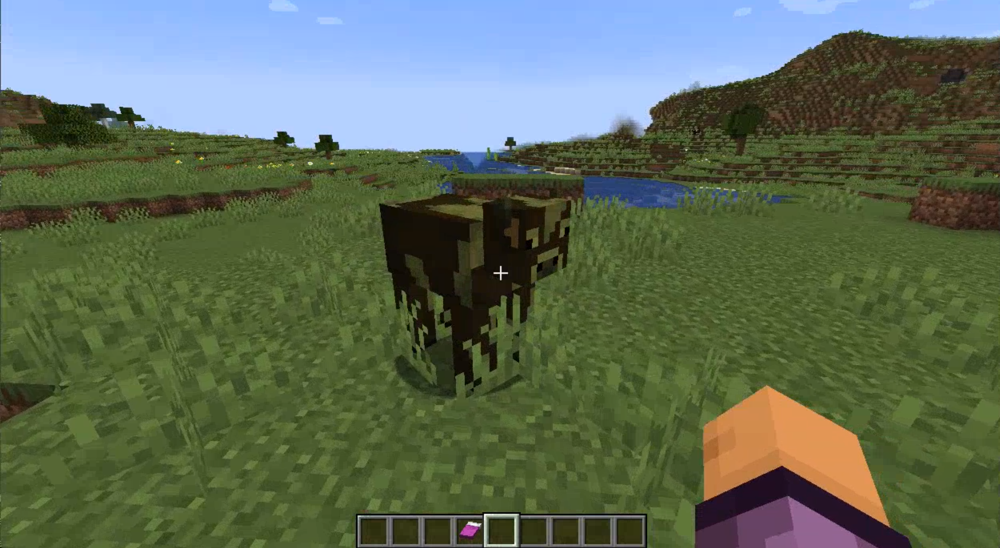
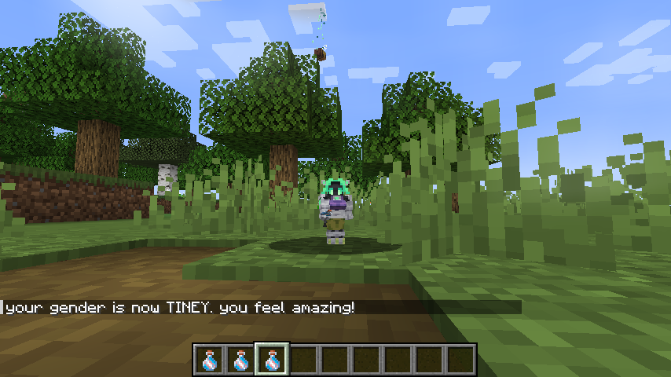
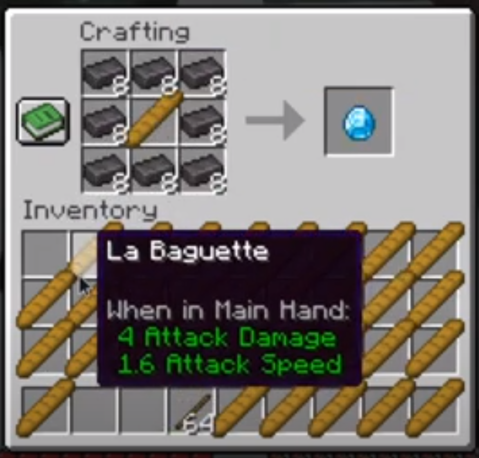
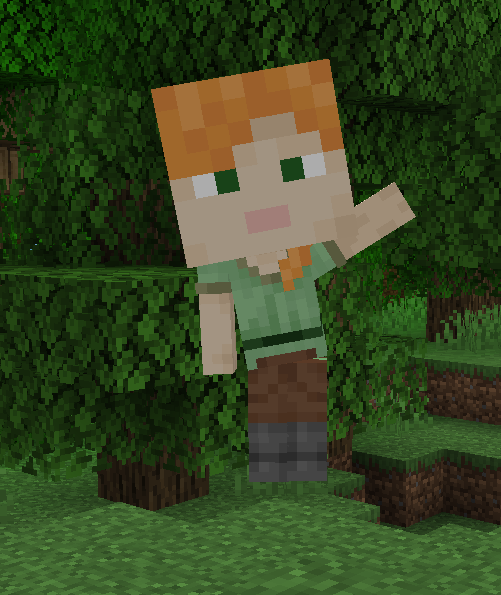

This month of course comes with April Fools' Day, and that means a Minecraft
April Fools' snapshot! This year Mojang brought us the "Vote Update", in which players
regularly vote on proposals, each of which changes the
game world in ways ranging from changing the colour of grass, to activating the moon, to...turning the game French?
C'est bizarre.

Anyway, with this snapshot came an impromptu ModFest, dubbed a
"FlashFest". The fest gave contestants 24 hours to make anything they
could with this snapshot. Let's look at some of the entries!

## sschr15

sschr15 made a rule called "Constant Jeb". And, yes, you guessed correctly. It makes _every_ entity have the rainbow Jeb sheep effect constantly. Poor cow.

They also made a rule that makes trading free. This is perhaps the most unrealistic rule of them all (I'm looking at you, villager charging 34 emeralds for a wooden hoe).

## LemmaEOF

Lemma, the organiser of the fest, submitted the "Bottle of Gender" (https://modrinth.com/mod/bottle-of-gender). By brewing light blue dye into a bottle of Dragon's Breath, you can now obtain this mysterious brew. Drink it to change your skin, gender term, name color, and size.

So what's the coolest bit? "More genders can be added via datapacks". This is not a sentence I thought I would ever read, but it's good to hear that people can add more gender™ without a need for programming.

## Sylv

Sylv made a mod called "Unobtanium". It really cries back to the era of Emerald armour and smelt-able rotten flesh mods. Unobtanium is an overpowered material that can be crafted with Netherite and...baguettes? Whatever floats your boat (or, slays your enemies in this case).

These weren't the only submissions, but I thought they were the most showcase-able. For example, we also had the catchily-named "Machine-Vote-Gun-Chan", and EmoteCraft was ported to the snapshot.

The FlashFest was a great
success, and we hope to see more of these in the future - if you want
to see all the submissions, check out ModFest's Discord server
(https://discord.gg/gn543Ee). For now, here's oddly-sized Alex and EmoteCraft to wave goodbye.

