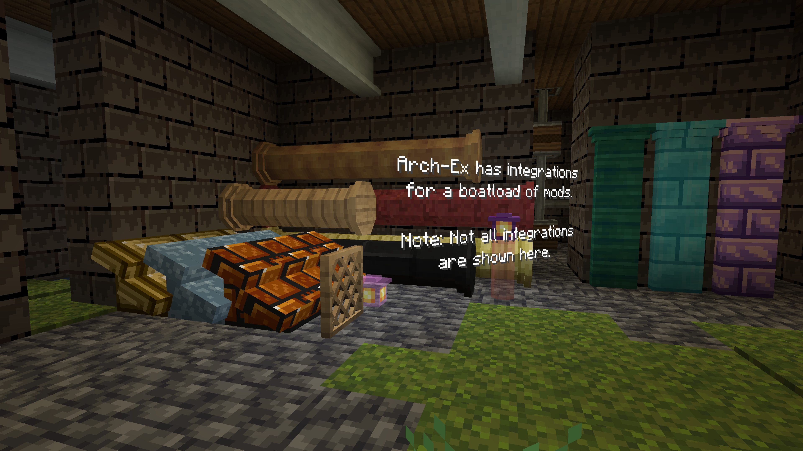
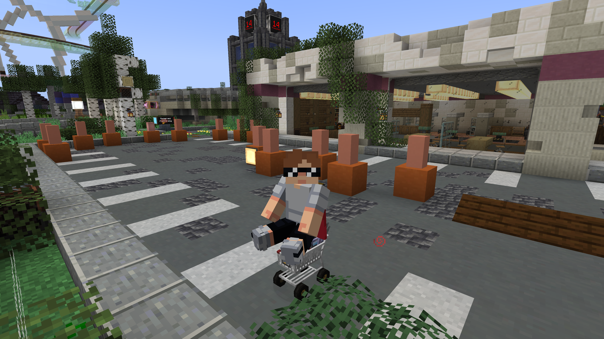

This article is the first in a series of 'quick-fire' articles on projects at [BlanketCon 23](https://blanketcon.modfest.net).

These lists are in no particular order and mods haven't been chosen based on any particular criteria. While we will do our best to cover as much as possible, we really recommend joining the server to explore for yourself.

---

## [Bovines and Buttercups](https://modrinth.com/mod/bovines-and-buttercups)

- 
- 
- 
- 

## [CC:C Bridge](https://modrinth.com/mod/cccbridge)

- 
- 

## [Mythic Metals](https://modrinth.com/mod/mythicmetals)

- 
- 
- 

## [Enchantery](https://github.com/AstralOrdana/Enchantery)

- 
- 
- 

## [Architecture Extensions](https://modrinth.com/mod/arch-ex)

- 
- 
- 
- 

## [Phonos](https://modrinth.com/mod/phonos)

- 
- 
- 
- 

## [Fabricae Ex Nihilo](https://modrinth.com/mod/fabricae-ex-nihilo)

- 
- 

## [Plushables](https://modrinth.com/mod/plushables)

- 
- 
- 

## [Sandwichable](https://modrinth.com/mod/sandwichable)

- 
- 
- 

## [Terracotta Knights](https://modrinth.com/mod/terracotta-knights)

- 
- 

## [Automobility](https://modrinth.com/mod/automobility)

- 
- 
- 
- 

## [Portal Cubed](https://modrinth.com/mod/portal-cubed)

- 
- 
- 

## [Electric Eel](https://github.com/HyperPigeon/ElectricEel)

- 

## [Controlify](https://modrinth.com/mod/controlify)

- 
- 

## [Blahaj](https://modrinth.com/mod/blahaj)

- 
- 

---

This post is part of MOD! Magazine's coverage of BlanketCon 23. Find us streaming on [YouTube](https://www.youtube.com/channel/UCYglRn3xc7uLOUfzWH2-QWQ) and [Twitch](https://www.twitch.tv/modmagazinemc/), join us on [Discord](https://modmagazine.net/discord), or read more of our coverage [here](https://modmagazine.net/issues).
