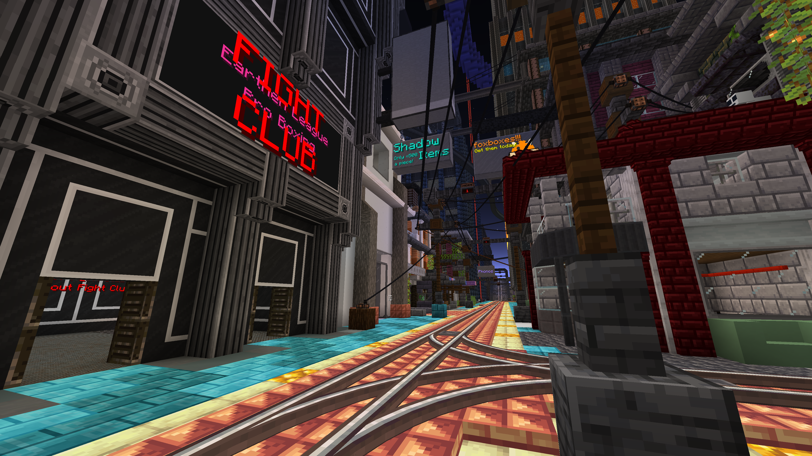
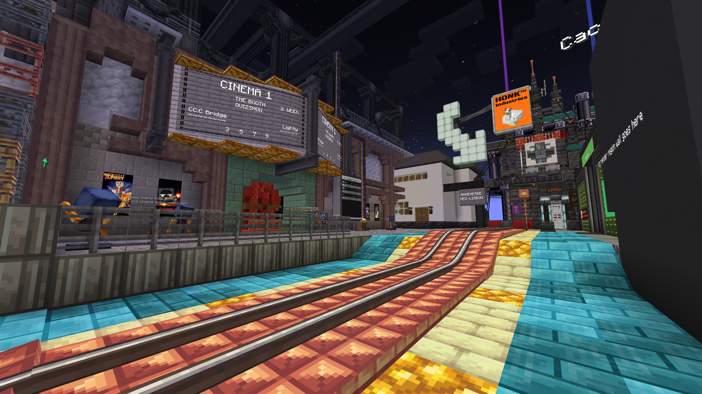
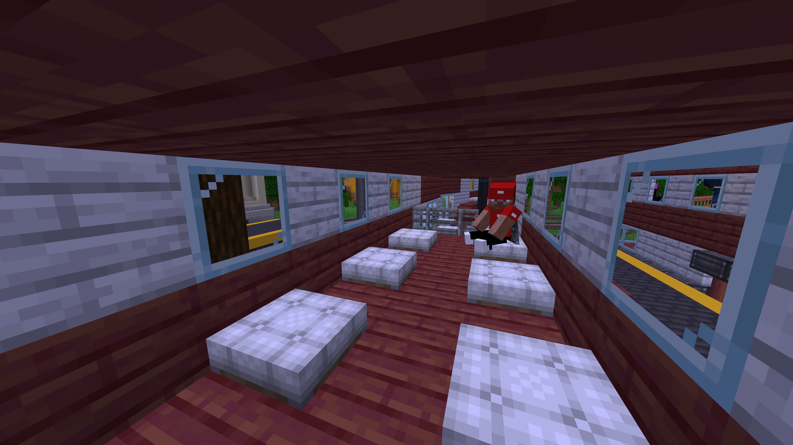

BlanketCon 23: Cyber/NOVA, an in-game modding convention hosted by ModFest, kicked off today with a short opening ceremony delivered by its organizers. The event will run until the 29th of August, after which the server will still be online for people to explore.

At the convention, entrant mods have their own area to showcase their features. There are also events running throughout BlanketCon including keynotes, panels, Q&A's, and games. To find out more about the booths and events at the convention this year, see [the BlanketCon website](https://blanketcon.modfest.net).

## The Map

After BlanketCon 22's success, it's safe to say that everyone was excited for the next iteration. While last year we had a 'cottage-core' theme, this year we're being treated to what could be considered as two themes: solarpunk and cyberpunk - officially neo-lisbon.

The cyberpunk section of the map is a huge dystopian-style city with back alleyways, an illegal business district, and plenty of questionable corporations.

- 
- 
- 

In contrast, the solarpunk area is less dense, with its greenery and overgrown towers.

- 
- 

A map this vast would not be possible without a robust transport infrastructure - luckily, [Create: Steam 'n' Rails](https://modrinth.com/mod/create-steam-n-rails) and its team (amongst others) have created a comprehensive automatic railway system. It's a feat of modded Minecraft engineering, and I'd recommend you take a ride.

- 
- 
- 
- 
  The world also contains plenty of Scattered Shards: collectibles that can be found in most booths, all powered by a mod made specifically for BlanketCon 23.

## The Organizers

As mentioned in the opening ceremony, some of which can be found on [our YouTube channel](https://www.youtube.com/channel/UCYglRn3xc7uLOUfzWH2-QWQ), BlanketCon would not be possible without the efforts of its organizers and the participants.

Whether it be optimizing the server, planning events, building booths, or any of the _many_ other responsibilities, the organizer team and participants have been hard at work for months to deliver this event.

## Join

Want to join us at BlanketCon? Download the [Modrinth pack](https://modrinth.com/modpack/blanketcon-23) ([not sure how?](https://docs.modrinth.com/docs/modpacks/playing_modpacks/)).

We'll see you there!

---

This post is part of MOD! Magazine's coverage of BlanketCon 23. Find us streaming on [YouTube](https://www.youtube.com/channel/UCYglRn3xc7uLOUfzWH2-QWQ) and [Twitch](https://www.twitch.tv/modmagazinemc/), join us on [Discord](https://modmagazine.net/discord), or read more of our coverage [here](https://modmagazine.net/issues).
